# matlab学习

| 数据类型 | 描述          |
| -------- | ------------- |
| int8     | 8位有符号整数 |
| unit8    | 8位无符号整数 |
|          |               |
|          |               |
|          |               |
|          |               |
|          |               |
|          |               |
|          |               |

## 矩阵的除法

1. 左除（\）

   > A\B = $A_{-1}$*B

   > X = A\B就是后面的式子的解 - - > A*X = B

2. 右除 (/) 

   > X = B/A 就是x*A = B 的解


## 线性方程组的求解

attention:

> 系数矩阵的秩 r = n (n为方程组中位置变量的个数)，则有唯一解
>
> 系数矩阵的秩r < n 则可能有无穷解

### 利用矩阵除法求线性方程组的特解

首先，写出系数矩阵以及结果矩阵，判断系数矩阵的秩是否等于其未知数的数量，如果等于其未知数的数量则表明有唯一解

```python
c =  rank(A) #计算矩阵A的秩
```

求解方程组的部分依据我们在开头提到的左除和右除法则，选择合适的式子进行相关的操作!

```matlab
X = A\B;  % A是我们的系数矩阵，B是我们的结果矩阵
```

### 利用LU分解求解方程组

这里我们使用到的思想就是一个矩阵的分解，原理也很简单，将一个矩阵转变为一个上三角矩阵和一个下三角矩阵的乘积的形式，下面我们进行详细的代码操作。

A = LU 其中，L为下三角矩阵，U为上三角矩阵。

那么A*X = B就变成了  L * U * X = B

那么我们的解X就变成了 X = U \ (L \ B)

```matlab
A
B
[L,U] = lu(A);
X = L \ (L \ B);
```

## 多项式的求值

函数$polyval$可以用来计算多项式在给定变量时的值，是按数组运算规则进行计算的。

> 语法：polyval(p,s)
>
> 说明：p为多项式，s为给定矩阵
>
> 例如：

## 多项式的根

roots

> 语法：roots（p1）
>
> 说明：求解多项式等于0时候的x的值

> 语法：poly(r)
>
> 说明：根据知道的根的值求解多项式的系数信息

## 多项式

### 乘

p = conv(p1,p2)

### 除

p = deconv(p1,p2)

### 求导函数

p = ployder(p1) -求多项式p1的导函数

p = ployder(p1,p2) - 求多项式p1和p2乘积的导函数

[p,q] = ployder(p1,p2) - 求多项式p1和p2之商的导函数，p，q分别是导函数的分子和分母。

## 数据插值

### 一维插值

四种方法：

linear # 线性插值

nearest 最相邻插值

spline 三次样条插值

cubic 三次多项式插值

yi = interp1(x,y,xi,’method’);

中心思想:先生成一个线性的xi，其数据之间的分度值要比原x数据的小。

### 二维插值

和一维插值有异曲同工之妙

> 关键变化：
>
> interp1 --> interp2

### 曲线拟合

曲线的拟合使用polyfit函数进行操作：

> 先进行x,y变量的数据准备
>
> 之后定义打算拟合出成几阶的函数
>
> 之后使用 p = polyfit(t,T,n);

## 函数的极限和导数

### 极限

limit(s,n,inf)

limit(s,x,a)

limit(s,x,a,‘left’) 求函数在a处的左极限

### 导数

diff对符号表示的函数进行求导

## 数值积分函数

### 基于变步长辛普森法的求定积分

> [I,n] =  quad(‘fname’, a ,b ,tol, trace)

### 牛顿-科特斯法

> [I,n] =  quad(‘fname’, a ,b ,tol, trace)

### 

## matlab符号计算

sym 、  syms

> 案例1： 计算多项式的和
>
> syms x
>
> p1 = ~ ~ ~
>
> p2 = ~ ~ ~ 
>
> p1+p2

符号和数值之间的转换：

> vpa命令可以将数值对象转化我任何精度的vpa型符号对象
>
> N = double(S)

## 符号表达式的化简

1. pretty函数 将给出排版形式的输出结果
2. collect函数 将表达式中相同次幂的项合并，也可以再输入一个参数指定以哪个变量的幂次合并
3. expand函数 将表达式展开成多项式形式
4. horner函数 将表达式转化为嵌套格式
5. factor函数 将表达式转化为因式格式
6. simplify函数 利用函数规则对表达式进行化简
7. simple函数  调用matlab的其他函数对表达式进行综合化简，并显示化简过程

### 符号微分与积分及其变换

diff（f）——该函数可以求符号表达式的一阶导数、n阶导数

> syms a x;
>
> f = sin( a*x );
>
>  df = diff(f)
>
> df =

diff(f,a) ——传回f对指定变量a的一次微分值

> 分别计算f对x和n的微分值
>
> syms x n 
>
> f = x^n
>
> diff(f,n) —— 求f对n的一次微分值
>
> diff(f,x)——求f对x的一次微分值

diff(f,a,n)——传回f对指定变量a的n次微分值

> ……

### 符号表达式的级数

1. （1）symsum函数

   > 语法：symsum(s,x,a,b)
   >
   > 说明：x为自变量，x省略则默认为对自由变量求和；s为符号表达式；[a,b]为参数x的取值范围。

   ```MATLAB
   syms x k 
   s1 =  symsum(1/k^2,1,10);
   s1 = 
   s2 = symsum(1/k^2,1,inf);
   s2 = 
   ```

2. taylor函数

   > 语法：taylor(F,x,n) 求泰勒级数展开
   >
   > 说明：x为自变量；F为符号表达式；对F进行泰勒级数展开至n项，参数n省略则默认展开前5项

### 符号表达式的积分运算

int函数用以计算函数的积分项，这个函数要找出一符号式F使得diff（F） = f 。如果积分式的解析式不存在或是Matlab无法找到，则int传回原输入的符号式。

1. int(f)	传回符号表达式f对变量x的不定积分
2. int(f,t)   传回符号表达式f对指定变量t的不定积分
3. int(f,a,b)   传回符号表达式f对变量x的积分值，积分区间为[a,b]，a,b为数值式
4. int(f,'t',a,b)    传回符号表达式f对变量t的积分值，积分区间为[a,b]  a,b 为数值式
5. int(f,'m','n')    传回f对变量x的积分值，积分区间为[m,n]，m,n为符号式

### 符号积分变换

#### 傅里叶变换及其反变换

1. Fourier变换

   > 语法：F = fourier（f,t,w）求时域函数f(t)的Fourier变换F
   >
   > 说明：返回结果F是符号变量w的函数，当参数w省略，默认返回结果为w的函数，f为t的函数，当参数t省略，默认自由变量为x。

2. Fourier反变换

   > 语法：f = ifourier(F) 求频域函数F的Fourier反变换f(t)
   >
   > ​		f = ifourier(F,w,t) 函数的用法与fourier函数的用法相同

#### 拉普拉斯变换及其反变换

1. Laplace变换

   > 语法：F = laplace(f,t,s) 求时域函数f的laplace变换F
   >
   > 说明：返回结果F为s的函数，当参数s省略，返回结果默认为's'的函数，f为t的函数，当参数t省略，默认自由变量为't'

2. Laplace反变换

   > 语法：f = ilaplace(F,s,t) 求F的Laplace反变换f

#### Z变换及其反变换

1. ztrans函数

   > 语法：F = ztrans(f,n,z) 求时域系列f的Z变换F
   >
   > 说明：返回结果F以符号变量Z为自变量，当参数n省略，默认自变量为‘n’,当参数z省略，返回结果默认为‘z’的函数

2. iztrans函数

   > 语法：f  =  iztrans(F,n,z) 求F得z反变换f
   >
   > 说明：


### 符号方程求解

#### solve（代数方程求解）

> solve(‘eq’,’v’) 求方程关于指定变量的解
>
> solve(‘eq1’,‘eq2’,‘v1’,‘v2’,……) 求方程组关于指定变量的解

例子：

> f1 = 
>
> solve(f1)
>
> ans = 

> eq1 = 
>
> eq2 = 
>
> eq3 = 
>
> [x,y,z] = solve(eq1,eq2,eq3);

#### 微分方程的求解

dsolve(‘eq’,’con’,’v’) 求解微分方程

dsolve(‘eq1,eq2,……’, ‘con1,con2,……’,‘v1,v2,……’) 求解微分方程组

其中，eq为微分方程，con是微分初始条件， v指的是自由变量

这里我们规定：

> y的一阶导数表示为Dy
>
> y的n阶导数表示为Dny

例题：

求微分方程
$$
x \frac{d^2y}{dx^2} -3\frac{dy}{dx} = x^2 ; y(1) = 0,y(0) = 0
$$
的解。

```matlab
y = dsolve('x*D2y-3*Dy = x^2','x')

y = dsolve('x*D2y-3*Dy = x^2','y(1) = 0,y(0) = 0','x')
```

求微分方程组$\frac{dx}{dy} = y, \frac{dy}{dt} = -x$的解。

```matlab
[x,y] = dsolv('Dx = y, Dy = -x');
```


## Matlab程序设计

### 顺序结构

1. 数据的输入input

   > A = input(‘input a number:’)

2. 数据的输出disp

   > disp(输出项)

### 顺序结构

1. for……end循环结构

   > for 循环变量 = 开始值：增量：结束值
   >
   > ​	循环体语句
   >
   > end

2. while ……end循环

   > while 表达式
   >
   > ​	循环体语句
   >
   > end

### 选择结构

1. if结构

   > if 条件
   >
   > ​	语句组
   >
   > end

2. switch……case结构

   > switch 表达式
   >
   > ​	case 值1
   >
   > ​			语句组1
   >
   > ​	case 值2
   >
   > ​			语句组2
   >
   > ​	case 值3
   >
   > ​			语句组3
   >
   > ​	otherwise
   >
   > ​			语句组m+1
   >
   > end

   

   ### 其他流程控制语句

   1. break命令

      > 说明：当break命令使用在循环体中的时候，其作用是可以使包含break的最内层的for或while语句强制终止，立即跳出该结构，执行end后面的命令

   2. continue命令

      > 说明：contine命令用于结束本次for或while循环，与break命令不同的是contine只结束本次循环而继续下次循环。该指令用于循环结构中，结束当前循环，执行下一轮循环！
      >
      > 一般用于求解在一个很大的数据体量中的极个别有特征的数字的排除。


## Matlab接口

> 三种类型的应用程序接口：外部程序调用接口、MAT文件应用程序(实现数据的输入输出)、计算引擎。

外部程序调用接口：

> 以MEX文件形式实现，使得用户可以再MATLAB系统的环境下直接调用C语言等编写的程序代码。编译MEX文件时，需要对MATLAB进行系统配置，以使MATLAB知道编译外部程序所使用的编译器类型与路径。

### MATLAB和excell的交互

> 命令行：xlswrite(‘fileaname’,M)
>
> xlswrite(‘filename’,M,sheet)
>
> xlswrite(‘filename’,M,’range’)
>
> xlswrite(‘filename’,M,’sheet’,’range’)’
>
> 输入参数解释：
>
> filename 	文件名
>
> M 			数组，也就是数据的意思
>
> sheet 		工作簿
>
> range 		工作簿中的数据区域
>
> xlsread——用法和xlswrite一样！！

## MATLAB在优化设计中的应用

### 建立优化问题

#### 选择优化器

#### 参数设置

```matlab
options = optimoptions(SolverName)%返回名称为SolverName的求解器的默认选择集
options = optimoptions(SolverName,Name,Value)%返回具有指定值更改的命名参数的选项
options = optimoptions(oldoptions,Name,Value)%返回具有指定值更改的命令参数的选项
options = optimoptions(SolveName,oldoptions)%返回SolverName求解器的默认选项。并将oldoptions中的适用选项复制到选项中。


%% 实操
options = optimoptions('fmincon');

```


### 无约束最优化问题

1. 无导数方法求无约束多变量函数的最小值

> x = fminsearch(fun,x0)——从x0开始找到使fun函数局部最小的x值
>
> x = fminsearch(fun,x0,options)——使用结构体options中指定的优化选项，使用optimset可设置这些选项
>
> x = fminsearch(problem)——找到使problem最小的x值，其中problem是结构体

2. 无约束多变量函数的最小值

> x = fminunc(fun,x0)
>
> x=  fminunc(fun,x0,options)
>
> x = fminunc(fun,x0,options)

### 有约束最优化问题

#### 求固定区间上单变量函数的最小值

> x = fminbnd(fun,x1,x2)
>
> x = fminbnd(fun,x1,x2,options)
>
> x = fminbnd(problem)

#### 求有约束的非线性多变量函数的最小值

> x = fmincon(fun,x0,A,b)——从x0开始，并试图找到满足线性不等式A*x<b的fun描述的函数的最小值x。x0可以是标量、向量或矩阵。
>
> x = fmincon(fun,x0,A,b,Aeq,beq)——求fun的最小值，满足线性等式Aeq*x = beq和A* x<b
>
> x = fmincon(fun,x0,A,b,Aeq,beq,lb,ub)——定义x中设计变量的一个下界和上界，使得该解总是在范围lb<x<ub
>
> x = fmincon(fun,x0,A,b,Aeq,beq,lb,ub,nonlcon)——求最小值，满足nonlcon中的定义的非线性不等式c(x),或等式ceq(x)

#### 求半无限约束多变量非线性函数的最小值

> x = fseminf(fun,x0,ntheta,seminfcon)从x0开始

> x = fseminf(fun,x0,ntheta,seminfcon,A,b)——也尽量满足线性不等式A*x<b

### 多目标优化问题

> 解决多目标目标实现问题：
>
> x = fgoalattain(fun,x0,goal,weight)
>
> x = fgoalattain(fun,x0,goal,weight,A,b)
>
> x = fgoalattain(fun,x0,goal,weight,A,b,Aeq,beq);
>
> 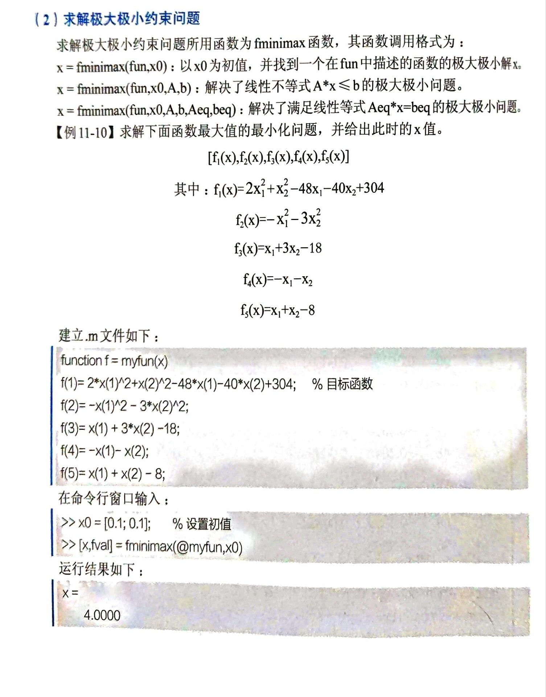


### 基于求解器的最优化

1. 整数线性规划求解

   注意：这里的式子都要变为小于等于的格式

> x=  intlinprog(f,intcon,A,b)——A * x < b
>
> x = intlinprog(f,intcon,A,b,Aeq,beq) ——满足1的同时同时满足Aeq * x = beq,如果不存在不等式，则设置A = [],b = []
>
> x = intlinprog(f,intcon,A,b,Aeq,beq,lb,ub)

2. 求解线性规划问题


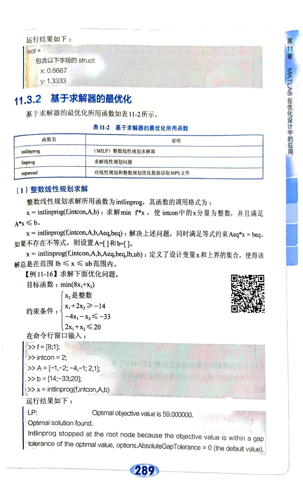

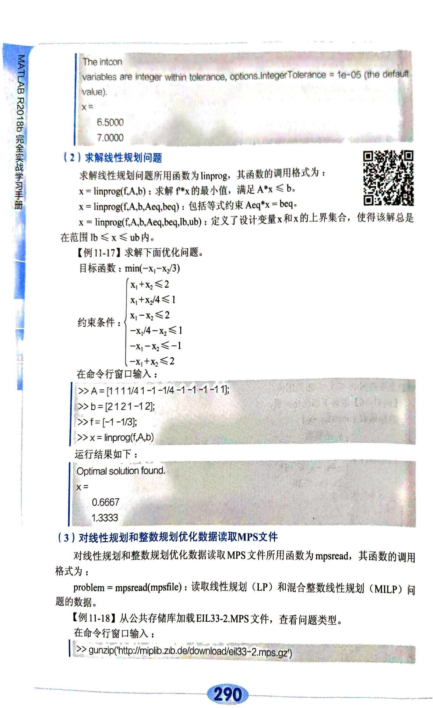

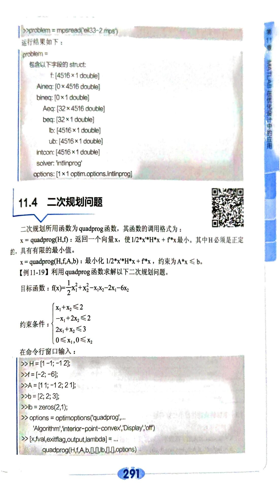

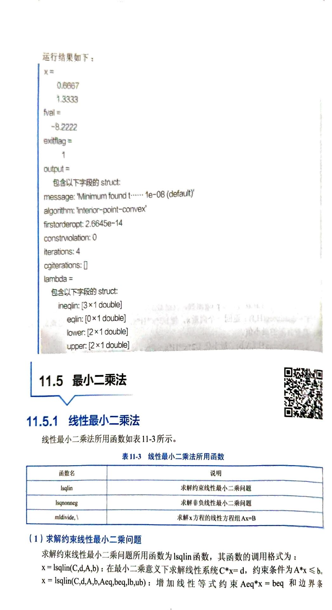

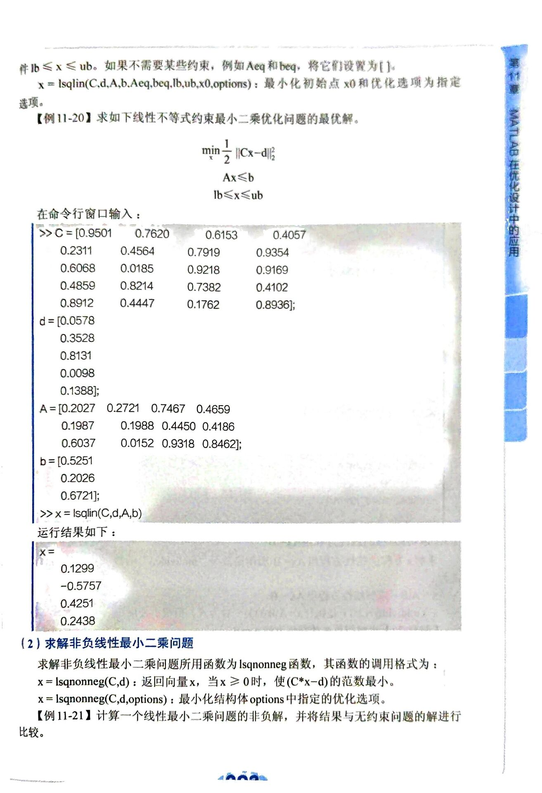

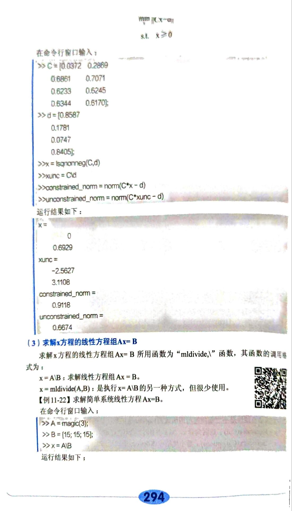

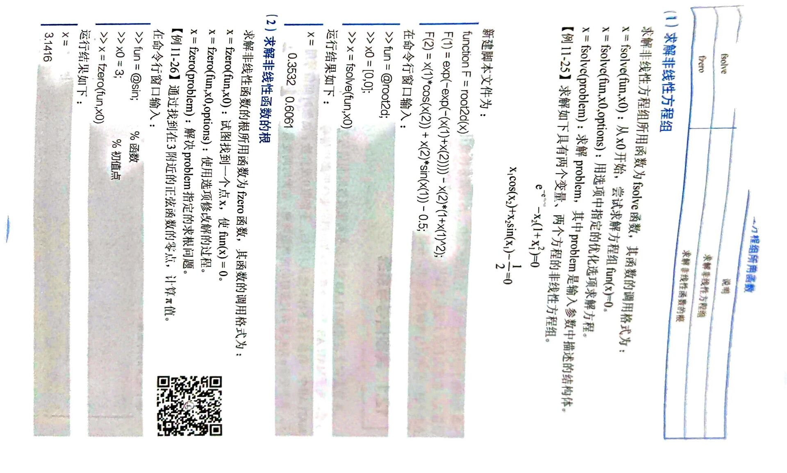

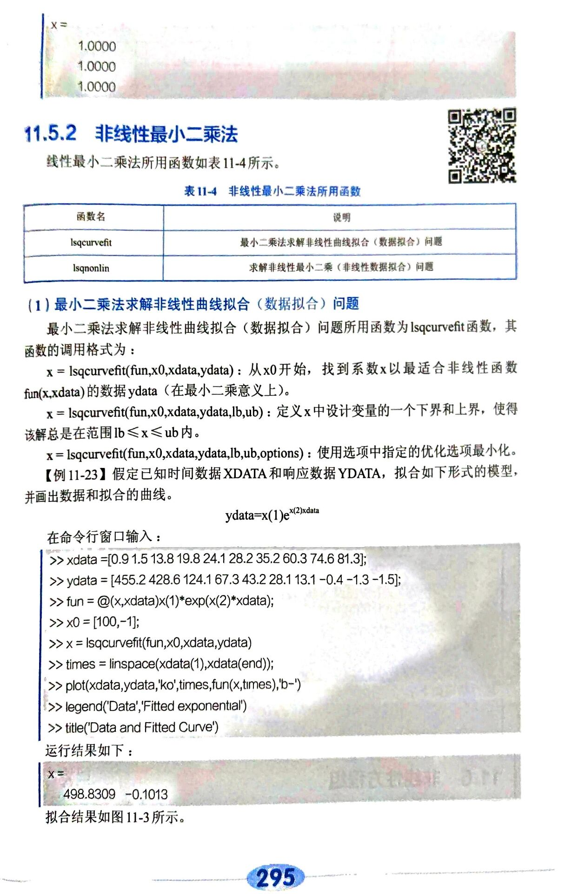

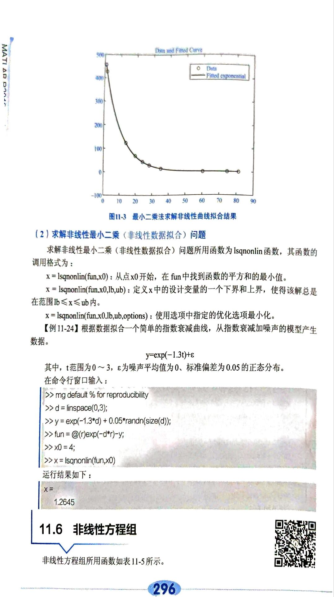

## 绘图命令集合

> plot()
>
> plot3()

图形的标注、图例说明及网格

> title(‘string’)
>
> xlabel()
>
> ylabel 
>
> legend()——添加图例
>
> text()——添加文字注释

网格

> grid on 
>
> grid off

多次叠图和多子图操作：

1. 同一个窗口多个子图

>  subplot(m,n,k);

2. 同一窗口多次绘图

> hold on 
>
> hold off

3. 双纵坐标图

> plotyy(x,y1,x,y2)

4. 坐标控制命令

> axis

三维网线图和表面图的绘制：

1. 网格生成函数meshgrid

> 首先，先以底部为基准生成网格
>
> [X,Y] = meshgrid(x,y)

2. 三维网线图

> [X,Y] = meshgrid(x,y)
>
> Z = 
>
> mesh(X,Y,Z)
>
> meshc:在mesh的基础上增加等高线
>
> meshz:在mesh基础上绘制边界

3. 三维曲面图

> surf(z)

4. 三维柱面

> cylinde(r,n)
>
> sphere()——三维球面

综合：

> hidden off
>
> hidden on 隐藏被遮盖的网格
>
> view([])改变视角
>
> peaks：：： 曲面镂空
>

# Matlab面向对象编程

## 面向过程&面向对象

### 面向过程

> 把问题的过程按照步骤分解出来，然后用函数(Function)的形式把这些步骤加以实现，并以此调用他们。
>
> 以函数为中心，函数操纵数据，

### 面向对象

> 把任务分解成一个个相互独立的对象（Object）,通过各对象之间的组合和通信来模拟实际问题。

#### 什么是对象：

> 这里的对象指的是真实世界中具体的东西，比如一只狗、一辆汽车……即生活中一切有形或无形的，可以具体标识的事物，具有以下的特点：
>
> 1. 具体的事物都有各种属性，比如名字，坐标轴上线段的长短，位置，这些都定义为对象的属性（Property）
> 2. 具体的事物还具有相关的行为，在OOP中，把这种行为定义为对象的方法（Method）

#### 什么是类：

> 类就是对个具体、相似对象的共性的抽象。

#### 如何把面条抽象成class

> 首选要抽象出面条的特点，比如种类type（有宽有细）,状态（state）——熟和不熟。还需抽象出面条相关的操作，通过方法来表示，比煮面条（boil()）;

#### 面向过程编程的局限性

面向过程：

> 每增加一个新的需求就需要重新进行代码的修改，这个时候的时间浪费太多了。

#### 面向对象编程的优点

> 1. 把大问题分解为小的对象
> 2. 通过组合和信息传递完成任务
> 3. 通过继承达到代码的复用
> 4. 修改或添加模块不会影响到其他模块

## MATLAB面向对象程序入门

### 如何定义一个类

> MATLLB中的类无处不在，我们经常定义的double、char等等都离不开类的影子。
>
> 下面我将给出最简单的定义类的语法：

```matlab
classdef Point2D < handle
	properties %属性block的开始
		
	end %属性block的结束
	
	methods %方法block的开始
	
	end
	
end
```

## 类的属性

### 如何访问对象的属性

> 使用dot运算符进行对象的属性的访问。

### 什么是属性的默认值

> 在properties中可以为属性直接赋给一个值，通过这种方式提供的值，叫做属性的默认值（Default Value）

### 什么是常量属性

> 常量属性，就是在对象生存周期中值保持不变的属性。无论在类内部或者外部对该属性进行修改都将报错。

```matlab
classdef A < handle
	properties（Constant）
	R = pi / 180
	end
end
```

常量属性常用来代表硬件指标

### 什么是非独立（depdent）属性

> 某个变量的值随着其他值得改变而改变，如果按照以往的定义的方法，这个时候我们每次更改其他变量时，都需要运行一下原来的方法， 这里我们采用depdent的方法进行该问题的解决。

计算该属性的方由get方法提供。

## 类的构造函数（Constructor）

### 什么是Constructor

> 和类的名称相同，用来创造类的实例
>
> 定义中只能有一个Constructor
>
> 有且只有一个返回值，且必须是新创建的对象，这是唯一创建一个新的对象的方式。

可以是用nargin来判断输入的参数的数量，从而采取不同的赋值方案。

> 有一种情况，当类的方法是空的时候，这时候定义这个类会返回一个空的。

## 类的继承

### 什么是继承

> 继承是一种提供代码的重用方法、
>
> 继承的本质就是一个机制，使得我们能够利用类和类之间“相似”的关系，利用已有的代码，在Point2D类的基础上定义出一个Point3D类。在Point3D类中，只需添加多出来的属性和方法就可以了。

```MATLAB
classdef Point3D < Point2D
	properties 
		z
	end
	methods
	function obj = Point3D(x0,y0,z0)
	obj = obj@Point2D(x0,y0)
	obj.z =z0
    end
    function print(obj)
    print@Point2D(x0,y0)
    disp(['z = ',num2str(obj.z)]);
    end
end
```

> 这里我们详细学习一下子类和父类的继承，这里的继承说的实话方法的继承，这里大多是以@的符号进行，这里的@符号没有其他的用意，只是告诉MATLAB，要记性父类的方法的继承！！
>
> 下面具体介绍一下，在子类方法中如何调用父类同名的方法：

```matlab
superMethod @superClass(this,otherArugments);

```

> 代码中的supermethod就是同名的方法
>
> superClass指的是父类的类的名称
>
> this指的是把子类对象的handle传递给父类
>
> otherArugments 指的是向父类同名函数传递其他参数

### 什么是多态

> 同名的方法有多个不同的变量。

## 类之间的基本关系：继承、组合、聚集

### 如何判断B能否继承A

> 如果A是基类，B继承了A，那么B也就继承了A的成员变量和成员方法。

### 如何把类组合起来

> 这里注意一个经典的逻辑关系：
> 如果A是B的“一部分”，要用A的其他东西组合出B。
>
> such as:
>
> 眼、鼻、口、耳是头的一部分，我们不难发现，类Head应该由上述的几个足组合而成而不是派生而成。
>
> &表示多重继承

### Handle 类的set和get方法

> set方法为对象属性的赋值提供了一个中间层。
>
> get方法提供对成员属性查询操作的一个中间层。

## 如何设置属性和方法的访问权限

### 什么是public、protected、private权限

> Access = private, protected, public 来声明哪些属性和方法是可以公开访问的，受保护的，或者是不可以公开的，也就是私有的。
>
> private:表示只有该类的成员方法可以访问该数据，而子类和其他外部函数或者脚本无法访问到该成员变量。
>
> protected： 表示只有该类的成员方法可以访问该数据，子类也可以访问。
>
> public:无任何限制，都可以进行访问

> +表示public
>
> #表示protected
>
> -表示private
>
> 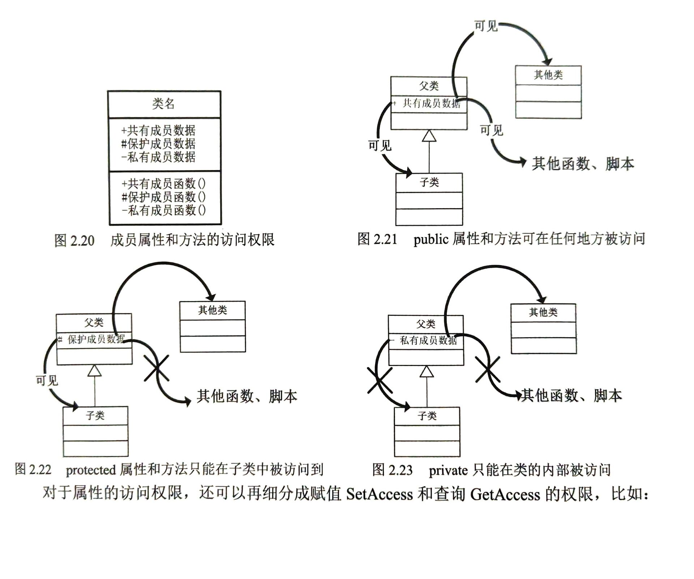

## Handle 和value的区别

> value存放的是具体的数值类型， 而我们的handle存放的是指向数值的地址信息。如果本来两个不同的handle都有其特殊的对应关系，如果我们将其中一个赋值为另外一个handle的数值，这时候，被赋值的这个handle原来所指向的数据被删除。

memory指令可以用来进行内存信息的跟踪！！

### 什么时候使用handle,什么时候使用value类

> 这里我们详细介绍一下这其中的区别
>
> handle中的属性之间可以产生一定的关联，比如说一个人的地址信息以及这个人的名字信息可以关联到一起
>
> value中的属性之间没有关联性，但是value没运行一个：
>
> value对内部数值的改动，必须返回（实际是创造了）一个新的对象，这里的例子也很明显，通俗地讲就是我们定义了一个5元的货币，但是我们如果要表达5*2的操作的时候，我们如果还使用handle来进行定义就会出现最基本的错误。

### 类的构造函数

#### 什么是对象的生存周期

> 通俗地说，就是这个数据在代码中的存活的时间，如果该数据在被使用后在后续没有被使用到，那么我们就可以将上述的数据进行删除处理。

#### 类的析构函数（Destructuor）

>  析构函数在对象脱离其作用于或者被销毁时（比如对象所在的函数已经调用完毕）负责收尾工作，比如关闭句柄、释放数据所占的内存空间等

#### 对object使用clear会发生什么

> 对于value o来说，自然是直接清除，对于handle o来说，是清除这个handle本身，至于数据会不会被清除则主要看有没有其他的handle指向这个数据。

#### 对object使用delete会发生什么

>  delete是handle类自带的，我们可以通过使用delete方法，来删除我们所提到的matrix，当执行完毕之后，无论当初有多少个handle指向matrix，这时候所有的handle都变成了空指向

#### delete何时被调用

> -  当我们的handle对象重新赋值的时候，原来指向的数据会失去指针，就会失效，被delete。
> - 当用户使用clear命令的时候，我们的delete命令也会被执行
> - 当对象离开了作用域的时候，delete方法会被用于释放内存

#### 何时用户需要自定义一个delete方法

> 当类的对象占用了一些系统资源，而无法自动释放时，需要自己重载一个delete方法来释放这些系统资源。

## 事件和响应

### 什么是事件

> 简单来说就是用户执行的操作，不论是数据读取还是用户的按键操作，只要引起了对象的变化的操作，都可以称之为是“事件”。

## MATLAB类文件的组织结构

### 如何使用其他文件夹中的类定义

> 如果想在其他路径使用某个类，就要用addpath命令添加该类，把包含该类的文件夹加到当前MATLAB路径中去

```matlab
addpath('z\folder1\folder2');
```

### 如何把类的定义和成员方法的定义分开

> MATLB规定，如果要把方法的定义normalize和disp放在单独的文件中，那么类的定义Point.m、normalized.m、display.m必须放在一个以@开头的文件夹中，且该文件夹要以该类的名字进行命名。

### 如何使用@point中类的定义

> 如果main程序要使用PointClass的类定义，只需要放在和该文件夹同一目录下即可，使用起来和前面类定义中放置全部的方法定义没有任何区别

### 如何定义类的局部函数

> 局部函数不是类的方法，在类的定义外部不可见，不能通过obj.method的方式从外界访问。局部函数仅对被类定义内部的方法可见。

## MATLAB对象的保存和载入

### save和load命令

> save filename obj ——把对象中的数据保存到名为filename的MAT文件中
>
> load filename obj ——把MAT文件中的对象obj装载到工作空间中

### saveobj 和 loadobj 命令

### 什么是瞬态属性

```matlab
classdef Calculation < handle 
	properties(Transient)
		……%这里定义的都是中间变量
	end
	properties
	……
	……
	end
end
```

# 面向对象GUI编程

## 如何使用guide进行gui编程

> 

